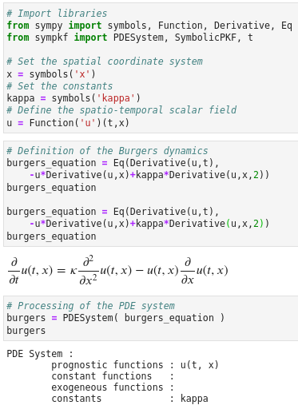
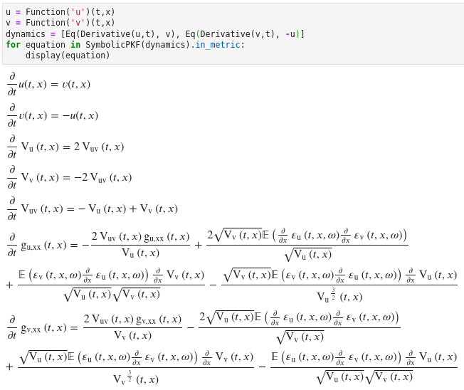

[SymPKF: a symbolic and computational toolbox for the design of
parametric Kalman filter dynamics](https://github.com/opannekoucke/sympkf)<!-- omit in toc -->
===============================================


- [Introduction](#introduction)
- [Examples](#examples)
  - [PKF for the Burgers equation](#pkf-for-the-burgers-equation)
  - [PKF for the 2D advection](#pkf-for-the-2d-advection)
  - [Illustration of the PKF applied on a system of evolution equation](#illustration-of-the-pkf-applied-on-a-system-of-evolution-equation)
- [Install](#install)
- [Citation](#citation)

Introduction
------------

Recent researches in data assimilation lead to the introduction of the parametric 
Kalman filter (PKF): an implementation of the Kalman filter, where the 
covariance matrices are approximated by a parameterized covariance model. 
In the PKF, the dynamics of the covariance during the forecast step relies on 
the prediction of the covariance parameters. Hence, the design of the parameter 
dynamics is crucial while it can be tedious to do this by hand.
This contribution introduces a python package, SymPKF, able to compute PKF dynamics 
for univariate statistics and when the covariance model is parameterized from the 
variance and the local anisotropy of the correlations. The ability of SymPKF to 
produce the PKF dynamics is shown on a non-linear diffusive advection (Burgers equation) 
over a 1D domain and the linear advection over a 2D domain. The computation of the PKF 
dynamics is performed at a symbolic level using [sympy](https://www.sympy.org) ([Meurer2017][]), but an automatic code generator is also 
introduced to perform numerical simulations. A final multivariate example 
illustrates the potential of SymPKF to go beyond the univariate case.


  - [O. Pannekoucke and P. Arbogast, “SymPKF (v1.0): a symbolic and computational toolbox for the design of parametric Kalman filter dynamics,” Geoscientific Model Development, vol. 14, no. 10, pp. 5957–5976, Oct. 2021, doi: 10.5194/gmd-14-5957-2021.](https://doi.org/10.5194/gmd-14-5957-2021).

<div>
<div style="float:left">
This work has been supported by the French INSU-LEFE, grant KAPA 
</div>
<div>
  
</div>
</div>

Examples
--------

### PKF for the Burgers equation

To illustrate SymPKF, we first consider the Burgers' equation. The dynamics is defined thanks to [sympy](https://www.sympy.org) [Meurer2017][]

**Definition of the dynamics by using sympy**

The definition of the Burgers dynamics relies on the definition of a coordinate system $(t,x)$ and the function $u(t,x)$. A pre-processing of the dynamics is performed by the class `PDESystem` of SymPKF, as shown in the following illustration.



**Computation of the PKF dynamics using SymPKF**
Then, the computation of the PKF dynamics is performed in SymPKF by using the 
class `SymPKF` as follows


It appears that the dynamics is not closed since the expression  can not be computed from the known quantities $u$, $V_u$ and $s_u$.

This shows that, in general, the PKF dynamics is not closed. 
To go further, a closure is needed, either from an analytical expression or from a data-driven strategy as proposed in [PDE-NetGen][]

**Automatic code generation for numerical simulations**

To illustrate the potential of using SymPKF, we introduce the closure proposed by [Pannekoucke2018][], and from which a numerical code can be rendered as follows


Here, `closed_kf_burgers` is an instance of the class `ClosedPKFBurgers` which has been generated at runtime. This class inherit from an abstract class `Model` useful methods. It can perform a `forecast` as well as an `ensemble_forecast` as shown in the following UML diagram


An example of numerical simulation performed from the runtime code is given here:


The notebook corresponding to the Burgers' dynamics can be found in the `./example/` directory [PKF on Burgers](./example/PKF%20on%20Burgers.ipynb) (see [pdf file](./example/PKF%20on%20Burgers.pdf) ).

### PKF for the 2D advection 

While SymPKF applies in 1D, it also applies in 2D and 3D domains. As shown in the following two pictures which detail the case of the advection equation.

          

see the corresponding notebooks [PKF for 2D advection](./example/PKF%20on%20the%202D%20advection.ipynb) ([pdf output](./example/PKF%20on%20the%202D%20advection.pdf). An ensemble validation is also provided as an example, but it relies on a side package `pydap` not published [PKF 2D with ensemble validation](./example/PKF%20on%20the%202D%20advection%20with%20ensemble%20validation.ipynb) (see [pdf output](./example/PKF%20on%20the%202D%20advection%20with%20ensemble%20validation.pdf) )


### Illustration of the PKF applied on a system of evolution equation

The present implementation of SymPKF can also be used to study the dynamic of multivariate situation as shown below.



See the corresponding notebooks [PKF for 1D harmonic oscillator](./example/PKF%20on%20the%201D%20multivariate%20oscillator.ipynb) ( see [pdf output](./example/PKF%20on%20the%201D%20multivariate%20oscillator.pdf) ) and [PKF for 2D harmonic oscillator](./example/PKF%20on%20the%202D%20multivariate%20oscillator.ipynb) (see [pdf output](./example/PKF%20on%20the%202D%20multivariate%20oscillator.pdf))


Note that this example shows that SymPKF can handle a system of partial differential equation.

Install
-------

### Using pip

A simple way to install `sympkf` is to use pip as follows

`pip install sympkf`

### Using github
 1. Clone the repository `git clone https://github.com/opannekoucke/sympkf.git`
 1. Install the package `make install` (or `python setup.py install`)
 1. Examples are given as jupyter notebooks (see ./example/) 


Citation
--------

```
@Article{Pannekoucke2021GMD,
  author    = {Olivier Pannekoucke and Philippe Arbogast},
  journal   = {Geoscientific Model Development},
  title     = {{SymPKF} (v1.0): a symbolic and computational toolbox for the design of parametric Kalman filter dynamics},
  year      = {2021},
  month     = {oct},
  number    = {10},
  pages     = {5957--5976},
  volume    = {14},
  doi       = {10.5194/gmd-14-5957-2021},  
  publisher = {Copernicus {GmbH}},
}
```

[Meurer2017]: https://doi.org/10.7717/peerj-cs.103 "A. Meurer et al., “SymPy: symbolic computing in Python,” PeerJ Computer Science, vol. 3, p. e103, Jan. 2017, doi: 10.7717/peerj-cs.103."
[PDE-NetGen]: https://github.com/opannekoucke/pdenetgen "PDE-NetGen : from symbolic PDE representations of physical processes to trainable neural network representations"
[Pannekoucke2018]: https://doi.org/10.5194/npg-2018-10 "O. Pannekoucke, M. Bocquet, and R. Ménard, “Parametric covariance dynamics for the nonlinear diffusive Burgers’ equation,” Nonlinear Processes in Geophysics, vol. 2018, pp. 1–21, 2018, doi: https://doi.org/10.5194/npg-2018-10."